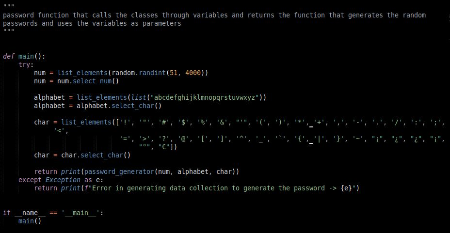
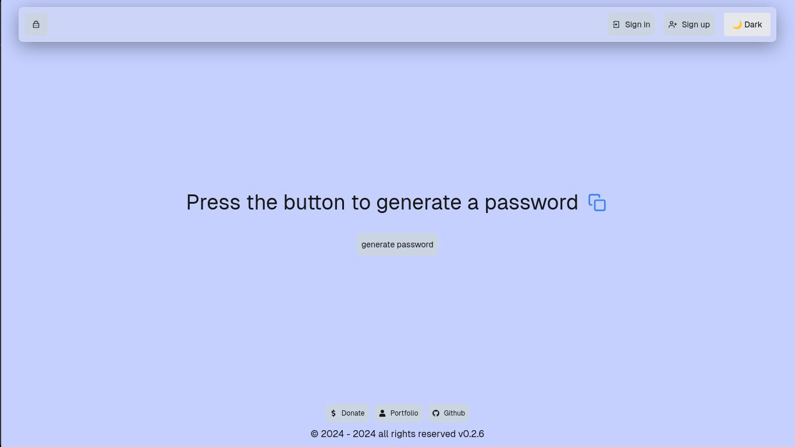

# Password Generator

In this repository you can find a python package that uses python's random package to generate passwords completely randomly, by randomly selecting from a list that stores the generated passwords.

In addition, its different applications were found so that the package can be consumed by users. For now, only its web application has been developed.

## Installation

You can install the package using `pip`. Run the following command in your terminal:

```bash
pip install edimez14-password-generator-1
```

## Usage

Once the package is installed, you can use it to generate passwords directly from the command line or by importing it into your Python script.

### Command Line Usage

You can generate a password by simply running the module from the command line:

```bash
python -m password_generator
```

### Programmatic Usage

You can also use the `password_generator` function programmatically in your own Python scripts. Here is an example:

```python
from password_generator import password_generator

# Define lists for numbers, strings, and special characters
list_num = list(range(0, 10))  # List of numbers
list_str = list("abcdefghijklmnopqrstuvwxyz")  # List of lowercase letters
list_char = ['!', '"', '#', '$', '%', '&', "'", '(', ')', '*', '+', ',', '-', '.', '/', ':', ';', '<', '=', '>', '?', '@', '[', ']', '^', '_', '`', '{', '|', '}', '~']

# Generate a password
generated_password = password_generator(list_num, list_str, list_char)

# Print the generated password
print("Generated Password:", generated_password)
```

### Function Details

- **`password()`**: Generates and prints a random password composed of numbers, lowercase letters, and special characters. This function is called when you run the module directly.

- **`password_generator(list_num, list_str, list_char)`**: Accepts three lists:
  - `list_num`: A list of numbers to be used in the password.
  - `list_str`: A list of strings (letters) to be included in the password.
  - `list_char`: A list of special characters to be included in the password.
  
  It returns a randomly generated password.

## Example

To generate a password, simply call the `password()` function:

```python
from password_generator import password

# Call the password function to generate a password
password()
```

## Console version

This is the console version of the program, and as you can see in the image, when you run the program what is returned is the main function that prints a randomly generated password in the console.


In the program code you can find three classes, each with its constructor that will store the parameters it needs to generate the random list of elements we need in a password.

Then each class has its method, which is the one that receives the parameters requested by the constructor and with those parameters it generates a random list of the elements that each class works with.


we have the password_generator function that requests three list type parameters that has a for loop that repeats 50 times to generate in each iteration a random password that is added to a list and then a variable randomly selects an index of that list of passwords and returns the variable with the chosen password.


Last but not least we have the main function that is responsible for storing each class in a variable and placing the parameter that it requests, then that variable calls the method that the class has to generate the list with the random elements.

The main function will return the password_generator function and the parameters it will set will be the variables that store the list of random elements.



## Web version 

When you enter the website, you will find a message that will tell you the things you can do on the website.
The framework I used to create the password generator web page was with Reactjs, Nextjs, axios, tailwind css to develop the frontend; on the other hand the development of the backend of the page was done with Django, Django Rest Framework, cors hearders, rest framework simpleJWT.



When you press the generate password button, the website will show a randomly generated password, and every time you click the button, it will generate a new password different from the previous one.


The page has a robust login and user registration system, so that registered users can have more features that the page offers.


When logging in or registering, the user will be able to continue generating passwords and will also see a menu button where he will see different buttons that will take him to different pages, such as one that will take him to his user profile, another that will redirect him to the page that shows him all the passwords he has saved, and there will also be a button to log out.


You can see that there is also a theme change button, where you can change from light to dark or from dark to light.

Also next to the button to generate passwords, a button will appear to save the passwords that the user wants to save. When that button is pressed, a modal will appear with a form that will ask for some data to save the password.


Page that shows registered users all the passwords they have saved.

On this page the user can select the password they want to update their data or delete the saved password.


Page that displays the profile data of registered users.

On this page the user can update their data or, if they wish, delete their account, thereby deleting all their saved passwords.


You can generate the number of passwords you prefer, there is no limit.