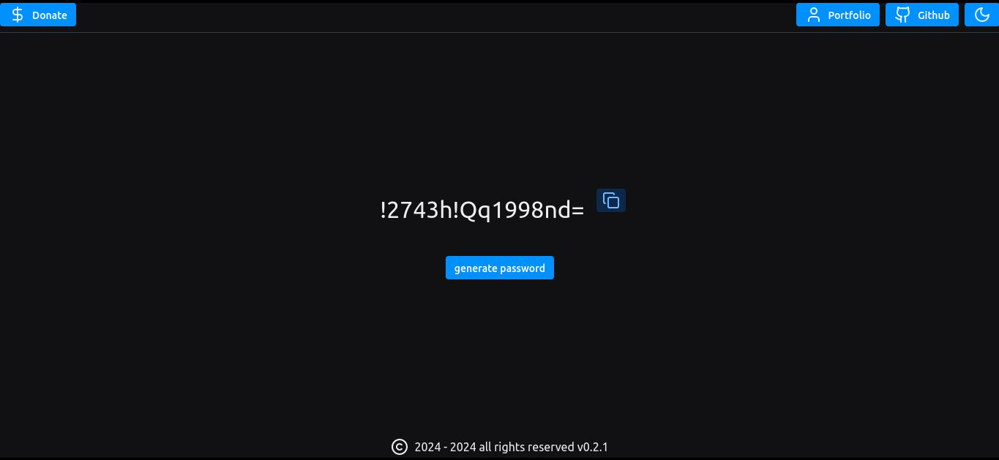

# Password Generator web version

When you enter the website, you will find a message that will tell you the things you can do on the website.
The framework I used to create the password generator web page is called reflex dev.

You can see that there is also a header that contains the buttons that redirect to the project's github repository, another button that redirects to my portfolio, another button that redirects to my donation link and finally a change theme button, where you can change from light to dark or from dark to light.

When you press the generate password button, the website will display a randomly generated password, and every time you click the button, it will generate a new password different from the previous one.

You can also copy the password by using the copy button that appears to the right side of the generated password.

At the bottom of the page you can see the footer with the version of the project, which is currently v0.2.1

You can generate the number of passwords you prefer, there is no limit.