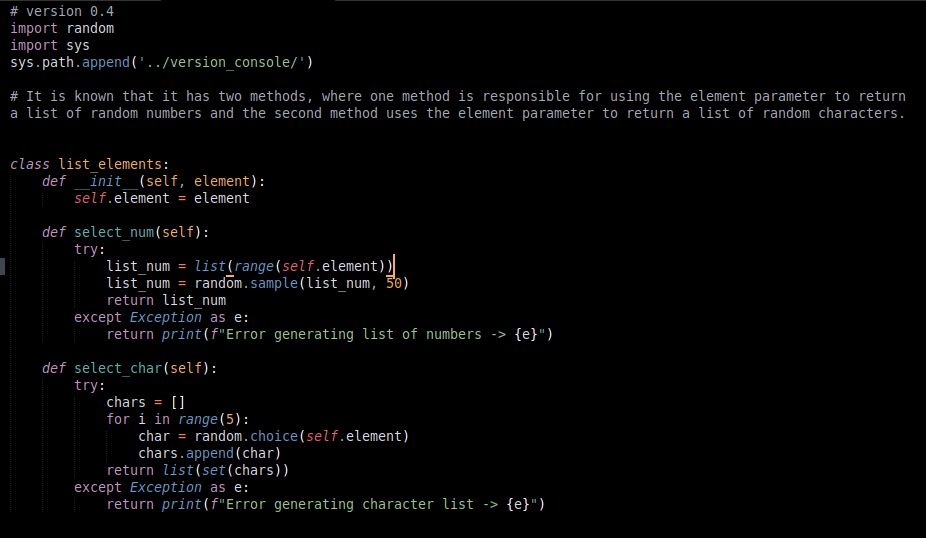

# Password Generator web version

In this repository you can find a program that generates passwords completely randomly, randomly selecting from a list that stores the generated passwords. 

The technology I used to generate random passwords is Rendom.

## Console version

This is the console version of the program, and as you can see in the image, when you run the program what is returned is the main function that prints a randomly generated password in the console.

In the program code you can find three classes, each with its constructor that will store the parameters it needs to generate the random list of elements we need in a password.

Then each class has its method, which is the one that receives the parameters requested by the constructor and with those parameters it generates a random list of the elements that each class works with.

we have the password_generator function that requests three list type parameters that has a for loop that repeats 50 times to generate in each iteration a random password that is added to a list and then a variable randomly selects an index of that list of passwords and returns the variable with the chosen password.

Last, but not least, we have the main function that is responsible for storing each class in a vareable and placing the parameter it requests, then that vareable calls the method that the class has to generate the list with the random elements.

The main function will return the password_generator function and the parameters it will set will be the variables that store the list of random elements.

## Web version 

When you enter the website, you will find a message that will tell you the things you can do on the website.
The framework I used to create the password generator web page is called reflex dev.

You can see that there is also a theme change button, where you can change from light to dark or from dark to light.

When you press the generate password button, the website will show a randomly generated password, and every time you click the button, it will generate a new password different from the previous one.

You can generate the number of passwords you prefer, there is no limit.