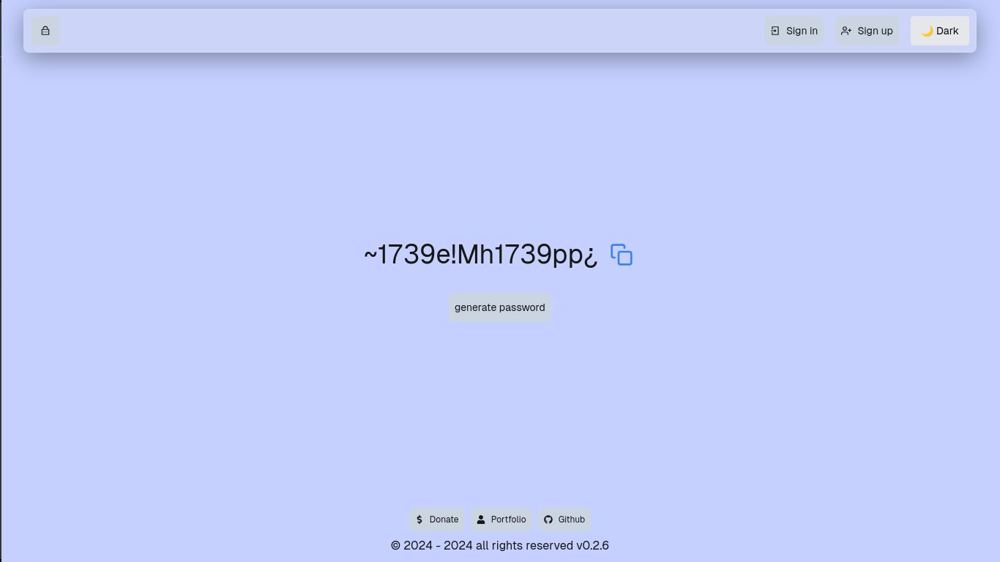
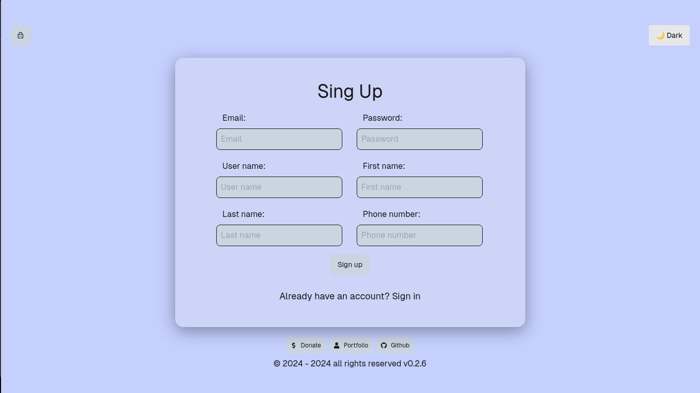

# Password Generator

## Overview

This repository contains a **Password Generator** project developed to demonstrate backend logic, API integration, and frontend architecture. The project evolves from a foundational Object-Oriented Programming (OOP) Python module into a complete full-stack web application with authentication and CRUD operations. It is a personal learning project intended to showcase technical proficiency.

---

## Tech Stack

**Frontend**

- React.js
- Next.js
- Tailwind CSS
- Axios

**Backend**

- Django
- Django REST Framework (DRF)
- SimpleJWT
- CORS Headers

**Core Logic**

- Python

---

## Core Module Installation & Usage

The core password generation logic is distributed as a Python package.

```bash
pip install edimez14-password-generator-1
```

### Command Line Execution

```bash
python -m password_generator
```

### Programmatic Integration

```python
from password_generator import password_generator

list_num = list(range(0, 10))
list_str = list("abcdefghijklmnopqrstuvwxyz")
list_char = ['!', '"', '#', '$', '%', '&', "'", '(', ')', '*', '+', ',', '-', '.', '/', ':', ';', '<', '=', '>', '?', '@', '[', ']', '^', '_', '`', '{', '|', '}', '~']

generated_password = password_generator(list_num, list_str, list_char)
print("Generated Password:", generated_password)
```

---

## Console Architecture

This is the console version of the program. When executed, it runs the main function and prints a randomly generated password directly in the terminal.


The internal architecture follows OOP principles. Three classes are defined, each responsible for managing a specific character group required for password generation. Each class constructor initializes its required parameters.

Each class exposes a method that generates a randomized list of elements based on the initialized parameters.


The `password_generator` function accepts three lists as input. It iterates multiple times to generate a pool of candidate passwords, randomly selecting and returning one of them to ensure sufficient entropy.


The `main` function acts as the entry point. It instantiates each class, invokes their generation methods, and passes the resulting lists to the `password_generator` function.


---

## Full-Stack Web Application

The project extends the core Python logic into a full-stack web application. The frontend is built using React.js and Next.js, styled with Tailwind CSS. The backend API is implemented with Django and Django REST Framework.

When accessing the website, users are presented with an interface describing available actions.


By pressing the **Generate Password** button, the application requests a new password from the backend API. Each request returns a different randomly generated password.



---

## Authentication and User System

The application implements a robust authentication and registration system. Registered users gain access to additional features beyond basic password generation.




After authentication, users can continue generating passwords and access a navigation menu. This menu provides routes to the user profile, saved passwords, and logout functionality.


---

## UI Features and State Management

The interface includes a global theme toggle, allowing users to switch between light and dark modes.

Authenticated users can save generated passwords. Clicking the save button opens a modal with a form requesting additional metadata before persisting the password.


---

## CRUD Operations

### Saved Passwords

This page displays all passwords saved by the authenticated user. Users can select any entry to update its data or delete it permanently.


### User Profile

The profile page displays the user’s account data. From this view, users can update their information or delete their account. Account deletion triggers the removal of all associated saved passwords.


---

## Notes

- Password generation has no hard limit.
- All persisted data is scoped to authenticated users via JWT.
- The project demonstrates end-to-end integration from core logic to user-facing application.
